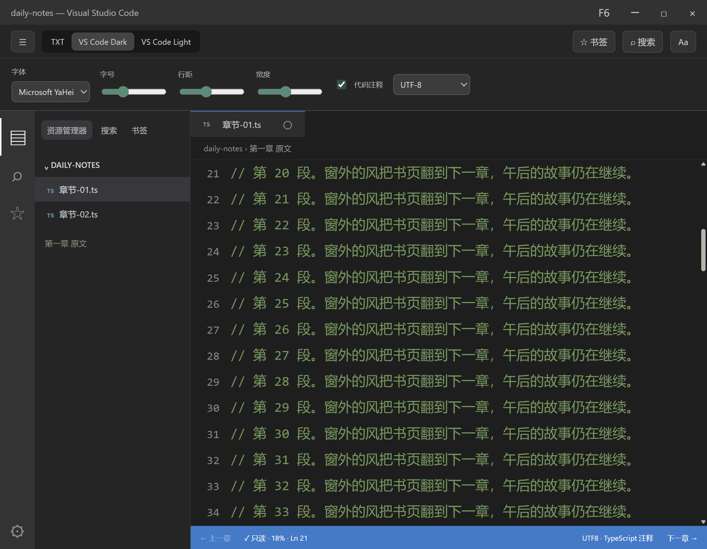
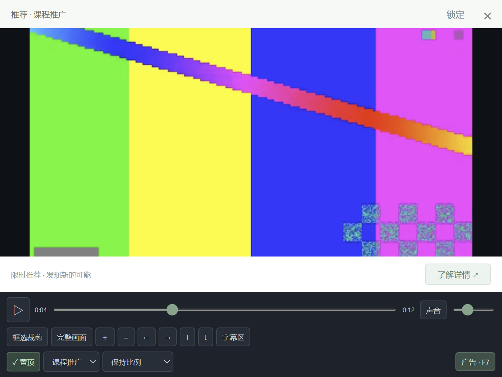
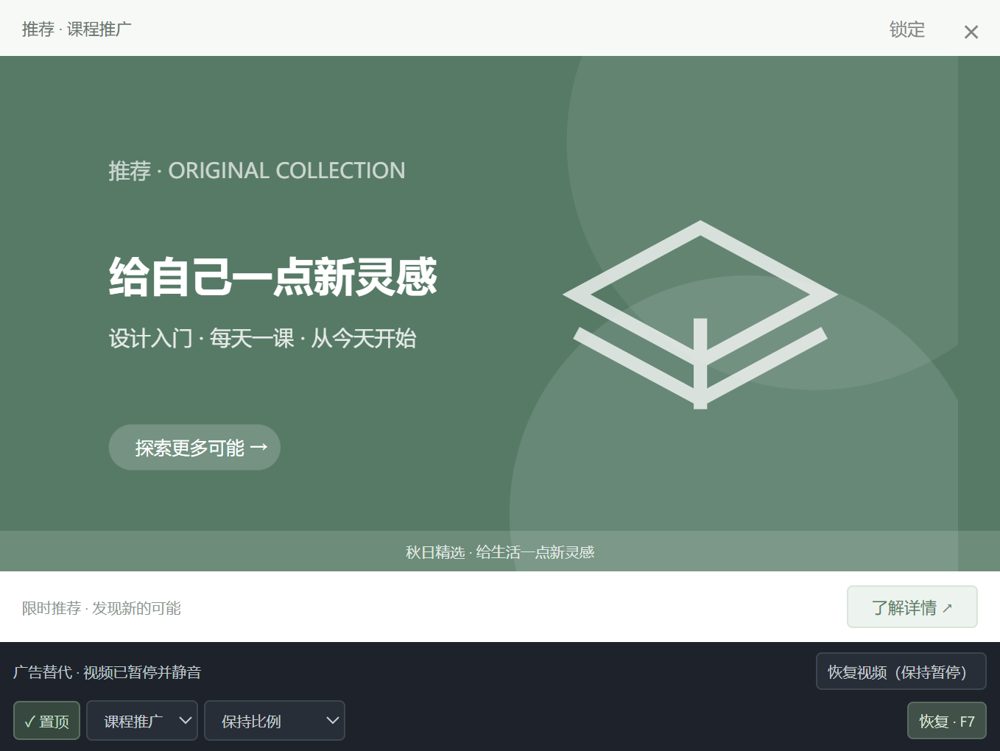

# 摸鱼神器 · touchFish

Windows 桌面阅读与悬浮视频工具，支持 TXT 小说、VS Code 风格阅读、本地视频裁剪、广告伪装，以及一键隐藏和恢复。

**[下载最新 Windows x64 便携版](https://github.com/liny666/touchFish/releases/latest)** · [后续计划](docs/FUTURE_IMPLEMENTATION.md)

此 repo 提供软件说明、截图和版本下载，源代码未在此仓库公开。

## 下载与运行

1. 打开上方下载页面，在 **Assets** 中下载 **Moyu-1.0.1-win-x64.exe**，约 100 MB。
2. 双击运行。只需要一个 EXE，无需安装 Node.js，也无需下载其他文件。首次运行会自动解压运行资源，可能需要等待几秒。
3. 可选下载 **SHA256SUMS.txt**，用于核对文件的 SHA-256。

适用于 Windows x64；已在 Windows 11 x64 实测，Windows 10 尚未在另一台实体机上单独验收。当前不提供 macOS、Linux 或手机版。本版本尚未做代码签名，下载或启动时可能出现系统安全提示。

GitHub 的 **Code → Download ZIP** 下载的是本页面的文档，不是可运行的软件，请到 **Releases** 下载 EXE。

## 功能与使用

### 小说阅读

- 在「我的书架」导入 TXT。支持 UTF-8、BOM、GBK / GB18030，单个文件上限 32 MiB；乱码时可手动选择编码重新解码。
- TXT、VS Code Dark、VS Code Light 三种外观，支持章节目录、全文搜索、书签和阅读进度保存。
- 导入的是本地副本，原文件不变；书名和项目别名可以修改。
- 附带原创短篇《午后列车》。当前没有接入番茄小说等外部 App，也没有漫画阅读功能。

### 悬浮视频与本地裁剪

- 在「悬浮视频」选择本地文件，或打开附带的 12 秒 MP4 演示。
- 独立窗口支持拖动、缩放、置顶、锁定、播放/暂停、音量、静音和进度调整。
- 裁剪步骤：**框选裁剪 → 重新框选 → 在画面上拖出矩形 → 调整四角或拖动选区 → 确认裁剪**。
- 「完整画面」重置裁剪；支持放大、平移和「字幕区」预设。裁剪只改变显示区域，不修改原视频文件。
- 纯视频模式下控件会淡出，移动鼠标即可显示。

### 在线视频

- 支持 YouTube 链接、Bilibili BV 链接/BV 号，以及 Bilibili 分 P 参数。b23 短链需要先在浏览器展开。
- 使用平台官方播放器；当前版本的在线来源不支持裁剪和拉伸。
- YouTube 隐藏或切换广告后会销毁播放器，恢复时按最近读取的位置重建且不自动播放，位置精度约一秒。
- Bilibili 隐藏或切换广告后会销毁播放器，恢复从头开始且不自动播放。
- 实际是否可播取决于平台、视频权限和网络；不可用、禁止嵌入等视频无法保证播放。

### 广告伪装与快捷键

可选择课程、商品、软件或工作面板外观，也可以导入自定义广告图片。同一个视频窗口切换广告后停止声音，恢复时视频保持暂停。

| 默认按键 | 动作 |
| --- | --- |
| F6 | 隐藏全部窗口，暂停并静音本地视频，销毁在线播放器 |
| F7 | 在已打开的视频窗口中切换广告伪装 |
| F8 | 恢复隐藏前可见的窗口 |

如果按 F6/F7 出现亮度、音量等硬件功能，请使用 **Fn + F6 / F7 / F8**。也可在设置中改为 `Ctrl+Alt+H`、`Ctrl+Alt+J`、`Ctrl+Alt+K`，点击保存并检查注册结果。被其他软件占用的按键会显示注册失败。

普通数字 `6` 和小键盘 `num6` 仅在阅读/视频窗口有焦点、且不在文本输入中时生效，不是系统全局快捷键。

## 托盘、恢复与退出

主窗口关闭默认隐藏到右下角托盘。右键鱼图标可显示主窗口、恢复、隐藏、进入设置或完全退出；视频窗口关闭会停止播放。

**v1.0.1 起，按 F6 隐藏后再次双击 EXE 即可恢复窗口。** 主窗口若已最小化也会还原，视频保持暂停。也可以按 F8（硬件键盘模式下为 Fn + F8），或右键托盘鱼图标选择「显示主窗口」。

从旧版更新时，先右键托盘鱼图标选择「完全退出」，再启动新版 EXE；个人书架、进度和设置继续保留。旧版仍在运行时双击新版，会由旧进程接收启动请求。

## 数据保存

小说副本、书签、阅读/视频进度、设置和窗口位置保存在本机。准确的数据目录可在设置页查看。

- 删除便携 EXE 不会自动删除个人数据。
- 「清除导入小说」不会删除用户原始 TXT。
- 本地视频保存的是原文件路径，移动原视频后需要重新选择。
- 完全退出后，手动删除设置页显示的数据目录可清除本地副本、缓存和设置。

## 当前验证与后续计划

首版在真实 Windows 11 环境中完成了 9 项核心测试、10 组桌面验收和 9 组边界验收。两个官方在线平台均使用具体样例验证了实际播放；解包版和单文件便携版均验证了启动、MP4 播放、隐藏、恢复和退出。

v1.0.1 再次通过 9 项核心测试，并使用真实解包 EXE 和单文件便携 EXE 验证「隐藏后启动第二个进程」能够恢复窗口、视频保持暂停且不产生重复主窗口；也验证了主窗口最小化和关闭后的恢复。

尚未完整验收 Windows 10、不同 DPI、多显示器热插拔及大型单章文本压力场景；在线视频样例成功不代表所有链接可用。

后续计划：[在线视频裁剪、外部小说平台及漫画、英文界面](docs/FUTURE_IMPLEMENTATION.md)。这些属于待尝试功能，当前版本尚未支持。
